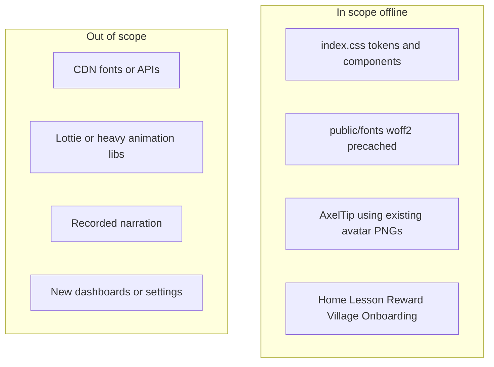

# Child-friendly UI polish (offline-first)

## Answer

**Yes.** The current shell is clean but reads like a small adult utility app (Segoe UI, dense lesson cards, prominent CAPS chips, small status text). Improving appearance for ages 7–9 is **in scope** for the pilot/MVP as long as changes stay on existing routes and ship as static assets precached by the PWA.

Aligned with [README.md](README.md) design principles (low text density, audio-first, positive reinforcement) and the completed 5-lesson cluster scope: **no cloud, no caregiver dashboard, no MP3 narration, no new lessons**.

---

## Current baseline

| Area | Today | Child gap |
|------|--------|-----------|
| Typography | `Segoe UI` system stack in [`prototype/src/index.css`](prototype/src/index.css) | Feels generic; headings not playful |
| Touch targets | Tap items ~52px; some text buttons smaller | Gr 2–3 need **48px+** consistently |
| Tone | Corporate blue `#185fa5`, muted CAPS chips on [`HomeScreen.jsx`](prototype/src/components/screens/HomeScreen.jsx) | Adult/teacher-facing on learner home |
| Character | Axel in copy only; avatars on home/onboarding | No visible guide during lessons |
| Delight | `fadeIn`, shake on wrong, reward emoji | Unlock/reward could feel more celebratory |
| Assets | 4 avatar PNGs already bundled (~360KB in build); emoji for CPA | Underused visual identity |

---

## Recommended standard pass (your choice)

### 1. Design tokens and global feel — [`index.css`](prototype/src/index.css)

- Add a small **child palette** alongside existing blue (e.g. warmer accent, success green, soft yellow hints) while keeping brand blue as primary.
- Increase base **heading and count-display** sizes; round corners on cards/buttons (16–20px).
- Enforce **min-height/min-width 48px** on `.tap-item`, `.num-btn`, `.choice`, `.lesson-card`, primary buttons.
- Add **`prefers-reduced-motion`** overrides for shake/pop animations.
- Soften **CAPS chips** (smaller, lower contrast, or move to secondary line) so home reads as “pick a lesson” not “curriculum audit.”

**Offline impact:** CSS only, no size regression.

### 2. Self-hosted rounded font — `public/fonts/` + Vite PWA

- Add one **woff2** family suited to children (e.g. **Nunito** or **Fredoka** — single regular + bold subset, target &lt;80KB total).
- Reference in `:root` with `system-ui` fallback.
- Ensure [`vite.config.js`](prototype/vite.config.js) `globPatterns` already includes `woff2` (it does).

**Offline impact:** Font precached with app; works after first load with no network.

### 3. Axel guide strip in lessons — new small component

- Create `AxelTip.jsx`: compact row with `educational.png` (or `happy.png` on success) + short subtitle from `lesson.concrete.subtitle` or stage-specific tip.
- Mount in [`LessonFlow.jsx`](prototype/src/components/screens/LessonFlow.jsx) below story-sum card (not on every sub-control—one strip per stage).
- Reuse existing imports from [`avatars.js`](prototype/src/data/avatars.js); no new image files.

**Offline impact:** Uses already-bundled PNGs.

### 4. Screen-specific polish (existing components only)

| Screen | Changes |
|--------|---------|
| **Home** [`HomeScreen.jsx`](prototype/src/components/screens/HomeScreen.jsx) | Setting emoji per lesson (`lesson.setting` → icon map); larger card tap area; visual “done” ribbon; de-emphasize lock text |
| **Lesson stages** [`ConcreteStage.jsx`](prototype/src/components/stages/ConcreteStage.jsx), [`PictorialStage.jsx`](prototype/src/components/stages/PictorialStage.jsx), [`AbstractStage.jsx`](prototype/src/components/stages/AbstractStage.jsx) | Stage tag pills with clearer color (existing `.stage-concrete` etc.); success pulse on correct; clearer progress bar (thicker, rounded) |
| **Reward** [`RewardScreen.jsx`](prototype/src/components/screens/RewardScreen.jsx) | Bigger stars animation; show unlocked building icon from `lesson.villageReward` |
| **Village** [`VillageScreen.jsx`](prototype/src/components/screens/VillageScreen.jsx) + [`index.css`](prototype/src/index.css) `.building` | Unlocked glow/scale; locked grayscale; optional simple “path” layout via CSS grid |
| **Onboarding** [`OnboardingNickname.jsx`](prototype/src/components/screens/OnboardingNickname.jsx), [`OnboardingAvatar.jsx`](prototype/src/components/screens/OnboardingAvatar.jsx) | Friendlier welcome line; larger avatar picks |

### 5. PWA manifest touch-up — [`index.html`](prototype/index.html), [`vite.config.js`](prototype/vite.config.js)

- Align `theme_color` / `background_color` with new tokens if palette shifts.

### 6. Docs (light)

- One paragraph in [`prototype/README.md`](prototype/README.md): child UI principles + offline font note.
- Optional line in [`docs/caps/curriculum_alignment.md`](docs/caps/curriculum_alignment.md) that CAPS chips are caregiver/field reference, styled secondary for learners.

---

## Explicitly out of scope

- Google Fonts CDN (breaks offline-first unless self-hosted).
- Lottie/Rive, video, or large illustration packs.
- MP3 narration (still `speechSynthesis` demo).
- New routes (parent dashboard, settings, shop).
- Replacing emoji CPA objects with custom SVG sets (nice later; not required for “standard” pass).

---

## Verification

- `npm run build` — precache size stays reasonable (font + CSS delta; avatars already included).
- Phone test: airplane mode after one load — font, avatars, lessons render.
- Touch: all interactive lesson controls ≥48px.
- Quick learner walkthrough: home → lesson (Axel visible) → reward → village unlock styling.

---

## Effort shape

| Work | Size |
|------|------|
| CSS tokens + touch targets + motion | Medium |
| Self-hosted font | Small |
| AxelTip + LessonFlow wire | Small |
| Home / reward / village / onboarding | Medium |
| Docs + build check | Small |

**Total:** ~2–3 days as estimated for “standard” pass.
