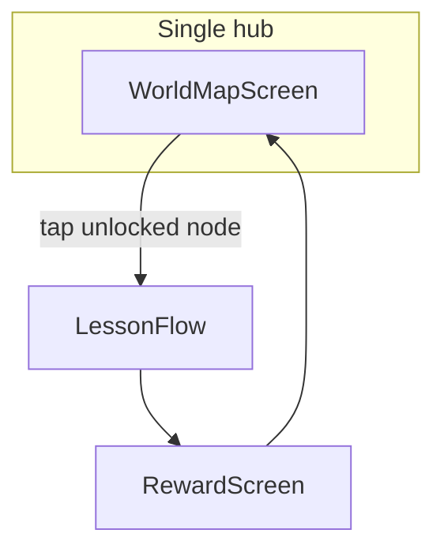

# Game-style world map hub (offline-first)

## Goal

Replace the vertical lesson list + separate Village screen with **one game-like world map** inspired by level-select maps (winding path, numbered stops, locked vs unlocked nodes)—using AXEL’s existing places: **spaza → park → market → school → taxi rank**, in [CAPS lesson order](prototype/src/data/lessons/index.js).

**Constraints (unchanged):** offline-first PWA, no CDN assets, no new routes beyond consolidating hub, no new lessons or backend.

---

## Reference vs implementation

Your [reference image](https://stock.adobe.com/search?k=game+levels) shows a **landscape + curved path + circular level buttons** (locked/active/completed). We will match that **interaction pattern**, not copy stock art:

- **CSS gradient sky + ground** (no licensed raster map)
- **Inline SVG path** connecting 5 nodes (dashed/solid segments; completed segments highlighted)
- **Large circular level nodes** (48px+ touch) with level number, setting emoji, short place name
- **States:** locked (grayscale + lock), **current** (next playable lesson pulses), completed (green ring + stars), accessible replay (glow)

All precached like today (~few KB CSS/SVG, no bundle spike).

---

## Architecture

### 1. Map data (single source of truth)

Add [`prototype/src/data/worldMap.js`](prototype/src/data/worldMap.js) (or extend [`village.js`](prototype/src/data/village.js)) with nodes aligned to `PILOT_LESSONS` order:

| Level | Lesson | Place | Icon |
|-------|--------|-------|------|
| 1 | counting-groups | Spaza shop | spaza |
| 2 | number-bonds | Park | park |
| 3 | addition-within-20 | Market stall | market |
| 4 | subtraction-objects | School | school |
| 5 | multiplication-grouping | Taxi rank | taxi |

Each node: `lessonId`, `level`, `name`, `icon`, `mapPosition: { x%, y% }` for a **zigzag path** (mobile portrait, ~360×520px map area).

Reuse existing helpers: [`isLessonAccessible`](prototype/src/data/lessons/index.js), [`getLessonLockMessage`](prototype/src/data/lessons/index.js), `progressMap`.

**Fix:** [`VILLAGE_BUILDINGS`](prototype/src/data/village.js) order currently mismatches lesson order (market before park); map data should follow **teaching order**, not the old grid order.

### 2. New component: `WorldMapScreen`

Create [`prototype/src/components/screens/WorldMapScreen.jsx`](prototype/src/components/screens/WorldMapScreen.jsx):

- Compact header: learner avatar + “Sawubona, {nickname}!” + subtitle (“Explore Axel’s neighbourhood”)
- Scrollable or fixed **`.world-map`** panel with:
  - Background layers (`.world-map-sky`, `.world-map-ground`, optional subtle hills via CSS `radial-gradient`)
  - SVG `<path>` behind nodes (stroke changes when segment “cleared”)
  - Five `<button class="map-node">` absolutely positioned from `mapPosition`
  - Node content: level badge `1–5`, emoji, place label; lock overlay when inaccessible
- Footer: language pills (unchanged), “Switch learner” ghost button
- **Remove** CAPS chips from map nodes (keep lesson titles only; CAPS stays in lesson flow / docs for field use)

Tap node → `onSelectLesson(lessonId)` (same as today).

### 3. Routing: merge Home + Village

In [`App.jsx`](prototype/src/App.jsx):

- Replace `HomeScreen` with `WorldMapScreen` on `ROUTES.home`
- **Remove** `ROUTES.village` branch and `onVillage` navigation
- Delete or repurpose [`VillageScreen.jsx`](prototype/src/components/screens/VillageScreen.jsx) (logic absorbed into world map)
- [`RewardScreen`](prototype/src/components/screens/RewardScreen.jsx): copy tweak—“Back to map” instead of “Back to home” (optional, small)

Lesson exit (`LessonFlow` back link) still returns to hub (map).

### 4. Styling — [`index.css`](prototype/src/index.css)

New block (~120–180 lines):

- `.world-map`, `.world-map-path`, `.map-node`, `.map-node--locked`, `.map-node--current`, `.map-node--done`
- Path segment colours: muted gray → primary blue → success green when prior level complete
- `prefers-reduced-motion`: disable pulse on current node
- Preserve `--touch-min: 48px`; nodes ~64–72px diameter

Deprecate unused `.lesson-list` / `.village-grid` rules only if no longer referenced.

### 5. Reward / unlock continuity

- [`RewardScreen`](prototype/src/components/screens/RewardScreen.jsx) already shows `lesson.villageReward` icon—keep as “You unlocked {place}!”
- Map node for that lesson shows completed state on return (existing `progressMap`)

### 6. Docs

- [`prototype/README.md`](prototype/README.md): hub is world map, not card list
- One line in [`docs/caps/curriculum_alignment.md`](docs/caps/curriculum_alignment.md) if needed (learner navigates by neighbourhood map)

---

## Out of scope

- Custom illustrated map PNGs / Adobe stock assets (licensing + weight)
- Parallax, Lottie, 3D, or sound effects
- New gameplay mechanics (coins, XP shop)
- Changing lesson content or CPA stages

---

## Verification

- `npm run build` — precache still reasonable
- Fresh learner: map shows level 1 active, 2–5 locked; completing unlocks next segment on path
- Prerequisites: subtraction still requires bonds + addition (node 4 locked until 2 and 3 done)
- Offline: map + fonts + nodes work after first load
- Touch: each map node ≥48px; screen reader labels (“Level 2: Park, locked”)

---

## File touch list

| Action | File |
|--------|------|
| Add | `worldMap.js`, `WorldMapScreen.jsx` |
| Edit | `App.jsx`, `index.css`, `village.js` (order/sync) |
| Remove/retire | `HomeScreen.jsx`, `VillageScreen.jsx` (after merge) |
| Light edit | `RewardScreen.jsx`, README |
