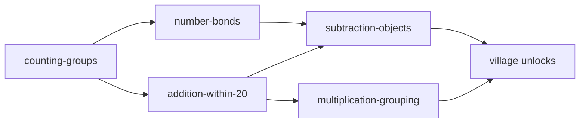

# MVP: complete 5-lesson CAPS cluster

## Goal

Turn the prototype into a **field-demo MVP**: all five lessons in the numeracy cluster are playable end-to-end (CPA + story sum + village unlock), still **offline-first**, **no backend**, **no new product surfaces** beyond what exists today.

**In scope (your choices):** complete existing cluster only; content + CPA polish.  
**Out of scope:** cloud sync, caregiver dashboard, MP3 narration, adaptive engine, lessons beyond the five-topic cluster.

---

## Current state

| Lesson | Status | Gap |
|--------|--------|-----|
| [`counting-groups.js`](prototype/src/data/lessons/counting-groups.js) | Playable | — |
| [`addition-within-20.js`](prototype/src/data/lessons/addition-within-20.js) | Playable | — |
| [`number-bonds.js`](prototype/src/data/lessons/number-bonds.js) | Metadata only | No CPA activities |
| [`subtraction-objects.js`](prototype/src/data/lessons/subtraction-objects.js) | Metadata only | No CPA activities |
| [`multiplication-grouping.js`](prototype/src/data/lessons/multiplication-grouping.js) | Metadata only | No CPA activities |

**Stage types today:** `tapCount`, `tapCombine` (concrete); `pickGroup`, `pickGroupPair` (pictorial); `pickNumber`, `pickEquation` (abstract).

**Home list order** in [`index.js`](prototype/src/data/lessons/index.js) does not match CAPS unlock order (bonds should appear before addition).

---

## Target learner journey

Prerequisites (already in [`foundation-phase-gr2-3.js`](prototype/src/data/caps/foundation-phase-gr2-3.js)) stay as-is; reorder `PILOT_LESSONS` to: counting → bonds → addition → subtraction → multiplication.

---

## Phase 1 — Extend CPA stage engine

Add three stage types (small, reusable handlers in existing stage components).

### 1. `pickBondPartner` (concrete) — Number bonds

- Show a **target sum** (10) and an **anchor** number (e.g. 7).
- Learner picks the **partner** from 3–4 choices (correct: 3).
- Second beat optional: one more bond (e.g. 6 + ? = 10) in same lesson via two-step concrete or single pictorial follow-up.

**Files:** [`ConcreteStage.jsx`](prototype/src/components/stages/ConcreteStage.jsx), [`LessonFlow.jsx`](prototype/src/components/screens/LessonFlow.jsx) (state: `bondChoice`).

### 2. `tapSubtract` (concrete) — Subtraction with objects

- Display `startCount` items (e.g. 12 oranges).
- Learner taps exactly `removeCount` to “take away”; remaining count shown.
- Proceed when `removeCount` tapped and display shows `startCount - removeCount`.

**Files:** [`ConcreteStage.jsx`](prototype/src/components/stages/ConcreteStage.jsx) (reuse tap-grid styling; track `removed` Set).

### 3. `tapEqualGroups` (concrete) — Multiplication as grouping

- Show `groups` rows × `perGroup` icons (e.g. 5 taxis × 4 wheels).
- Learner taps every icon (or tap each row to fill) until total `groups * perGroup` reached.

**Files:** [`ConcreteStage.jsx`](prototype/src/components/stages/ConcreteStage.jsx).

### Pictorial / abstract (reuse existing types)

| Lesson | Pictorial | Abstract |
|--------|-----------|----------|
| Number bonds | `pickGroup` on ten-frame style dots (7 + 3) | `pickEquation` e.g. `7 + 3 = ?` or `pickNumber` for partner |
| Subtraction | `pickGroup` — choose diagram with 7 left | `pickEquation` `12 - 5 = ?` |
| Multiplication | `pickGroupPair` or new `pickRows` (5 rows of 4 dots) | `pickEquation` `4 + 4 + 4 + 4 + 4 = ?` or `5 × 4 = ?` (introduce × symbol per CAPS 1.14) |

No number-line type in this pass (document as Phase 2 in caps doc).

---

## Phase 2 — Author three lessons (full CPA data)

### Lesson 3: Number bonds ([`number-bonds.js`](prototype/src/data/lessons/number-bonds.js))

- Setting: park / playground stickers.
- Concrete: `pickBondPartner` — bonds of 10 (7+3, then 6+4).
- Pictorial: which picture shows 10 altogether (7 dots + 3 dots).
- Abstract: `7 + 3 = ?` with options.
- `playable: true`; remove `lockReason`.
- Narration strings in lesson + optional entries in [`ListenButton.jsx`](prototype/src/components/ListenButton.jsx) map.

### Lesson 4: Subtraction with objects ([`subtraction-objects.js`](prototype/src/data/lessons/subtraction-objects.js))

- Setting: spaza shelf (12 oranges, sell 5).
- Concrete: `tapSubtract` start 12, remove 5.
- Pictorial: choose group showing 7 remaining.
- Abstract: `12 - 5 = ?`.
- Align with existing `contextProblem` in CAPS map.

### Lesson 5: Multiplication as grouping ([`multiplication-grouping.js`](prototype/src/data/lessons/multiplication-grouping.js))

- Setting: taxi rank (4 wheels × 5 taxis).
- Concrete: `tapEqualGroups` 5×4.
- Pictorial: pick the array with 5 groups of 4.
- Abstract: repeated addition `4+4+4+4+4=20` or `5 × 4 = 20` (display × with short subtitle “means equal groups”).
- `playable: true`.

---

## Phase 3 — Wire-up and polish

1. **Reorder** [`PILOT_LESSONS`](prototype/src/data/lessons/index.js) to CAPS teaching order.
2. **LessonFlow:** reset stage state per lesson; handle new concrete state shapes in `toggle`/handlers.
3. **ListenButton:** add narration keys for three new lessons (keep `speechSynthesis` demo).
4. **Village:** confirm all five buildings unlock via existing `isBuildingUnlocked` + completion flow.
5. **RewardScreen:** “Next lesson” should follow new list order and prerequisites.
6. **CSS:** styles for bond picker, subtract “removed” state, equal-group rows in [`index.css`](prototype/src/index.css).

---

## Phase 4 — Documentation

- Update [`docs/caps/curriculum_alignment.md`](docs/caps/curriculum_alignment.md): all five lessons **Playable: Yes**.
- Update [`prototype/README.md`](prototype/README.md): MVP = full cluster, new stage types listed.
- Update root [`README.md`](README.md) project status: “Pilot build (5 lessons)” instead of “2 playable + 3 scaffolded”.

---

## Testing checklist

- Fresh user: complete all 5 lessons in order without refresh bugs.
- Prerequisites: subtraction locked until addition **and** bonds done; multiplication locked until addition done.
- Offline: complete lesson 1, reload — progress and unlocks persist (IndexedDB).
- `npm run build` — bundle still acceptable (no large new assets).
- `await window.__axelExportEvents()` shows five `lesson_complete` events with `capsTopics`.

---

## Success criteria

- Five playable lessons, each with concrete → pictorial → abstract + story sum.
- CAPS metadata unchanged in source of truth; alignment doc reflects full cluster.
- Home list and unlock order match Grade 2 Term 1–2 pacing from [`curriculum_alignment.md`](docs/caps/curriculum_alignment.md).
- No new features outside content/CPA (per your scope choice).

---

## Estimated effort shape

| Work | Relative size |
|------|-----------------|
| 3 new stage type handlers | Medium |
| 3 lesson data files (×3 stages each) | Medium |
| LessonFlow + CSS polish | Small |
| Docs + build verify | Small |
