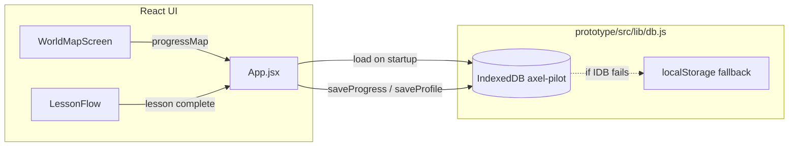
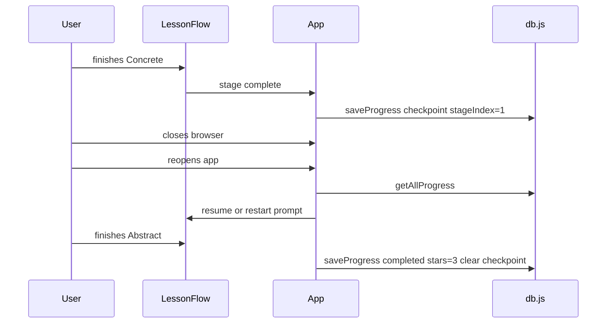

# Offline progress persistence for AXEL

## How it works today

Progress is **already stored on the device** — no network required after the PWA is installed/cached.



| Store | Key | What is saved |
|-------|-----|----------------|
| `profile` | `id: 'main'` | Nickname, `avatarKey`, `createdAt` |
| `progress` | `lessonId` | `{ completed, stars, lastPlayedAt }` per lesson |
| `events` | auto-increment | Analytics: session, lesson start/complete, answers |

**Load path** ([`App.jsx`](prototype/src/App.jsx)): on mount, `getProfile()` + `getAllProgress()` → React `progressMap` → map unlock states via [`isLessonAccessible`](prototype/src/data/lessons/index.js) + [`getMapNodeState`](prototype/src/data/worldMap.js).

**Save path**: first completion only — `handleLessonComplete` calls `saveProgress(lesson.id, { completed: true, stars: 3 })`. **Replay sessions do not write progress** (by design).

**Offline app shell**: Workbox precaches JS/CSS/fonts ([`vite.config.js`](prototype/vite.config.js)); persistence is separate from the service worker (IndexedDB survives SW updates).

**Switch learner**: [`clearProfile()`](prototype/src/lib/db.js) wipes all three stores — intentional reset, not multi-child support.

---

## What is NOT persisted today (gaps)

1. **Mid-lesson state** — If the child closes the app during Concrete/Pictorial, they lose in-lesson answers; map progress (completed levels) remains.
2. **Per-stage or attempt detail** — Only `completed` + `stars`; no history of replays, wrong answers, or partial CPA progress.
3. **Multiple learners** — Single `main` profile; switching learner clears everything.
4. **Explicit recovery UX** — No “progress saved” indicator or export/backup for parents/teachers.
5. **Schema versioning** — `DB_VERSION = 1` with no migration path if fields change later.

---

## Recommended approach (offline-first, minimal)

### Tier 1 — Document and harden what exists (low effort)

- Add a short **Persistence** section to [`prototype/README.md`](prototype/README.md): IndexedDB name, what is stored, Switch learner = full reset, replay = no new save.
- On app load, if `getProfile()` succeeds but `getAllProgress()` fails, surface a small non-blocking warning (data partial corruption is rare but possible).
- Ensure `refreshProgress()` runs after lesson complete (already does) and after returning from lesson to map.

### Tier 2 — Reliability improvements (pilot-friendly)

**A. Optional mid-lesson checkpoint (lightweight)**

- Extend progress record shape in [`db.js`](prototype/src/lib/db.js):
  ```js
  { lessonId, completed, stars, lastPlayedAt, checkpoint?: { stageIndex, lessonInstanceKey } }
  ```
- On stage advance in [`LessonFlow.jsx`](prototype/src/components/screens/LessonFlow.jsx), debounced `saveProgress(lessonId, { checkpoint })` (not `completed`).
- On lesson start: if `checkpoint` exists and user did not choose replay, offer “Continue where you left off?” vs “Start over”.
- Clear `checkpoint` on lesson complete or explicit exit with “start fresh”.

**B. Replay analytics only (optional)**

- `logEvent('lesson_replay', { lessonId })` without changing `completed` — helps later reporting without affecting unlock logic.

**C. Storage quota guard**

- Wrap writes with try/catch; if `QuotaExceededError`, fall back to trimming `events` store (oldest first) before failing profile/progress writes.

### Tier 3 — Multiple learners (when product is ready)

Default recommendation while “unsure”: **keep single learner for pilot**, but shape data for an easy upgrade:

- Change profile key from fixed `'main'` to `profileId` (UUID per nickname).
- Store `profiles[]` or keyed profiles in IndexedDB; **Switch learner** becomes pick/create profile instead of wipe-all.
- Scope `getAllProgress(profileId)` so each child has their own `progress` records (composite key `profileId + lessonId` or separate DB per profile).

Do **not** implement Tier 3 until you confirm sibling/multi-child UX (onboarding list, avatar, parent PIN, etc.).

---

## What to avoid for offline-only

| Approach | Why |
|----------|-----|
| Relying only on `localStorage` | ~5MB limit; IDB is already primary |
| Saving full lesson state in SW cache | SW cache is for assets, not user data |
| Server sync in v1 | Not required for offline; adds auth, conflict resolution, connectivity UX |
| Saving replay as incomplete | Would break linear unlock unless replay flag is explicit |

---

## Data flow after Tier 2 (checkpoint)



---

## Suggested implementation order

1. Document current behavior in README (no code behavior change).
2. Add checkpoint save/resume in `db.js` + `LessonFlow` + optional resume prompt in `App.jsx`.
3. Add quota handling + event store trim.
4. Defer multi-profile until UX for “Switch learner” is defined.

No changes to PWA precache are required for progress — IndexedDB and the service worker coexist independently on the same origin.
