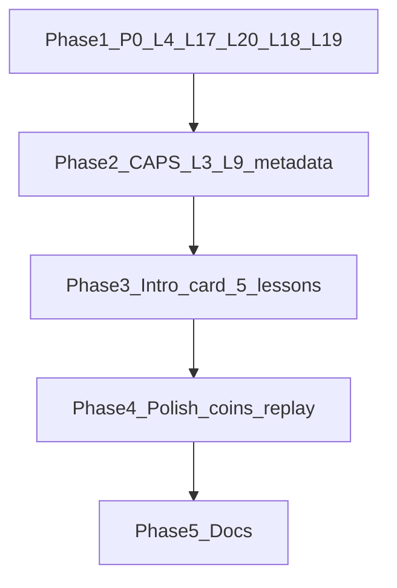

# Term 1 content fixes and curriculum alignment

## Scope

| In scope | Out of scope |
|----------|--------------|
| All **20 map levels** (content, CAPS metadata, docs) | New map art / pagination |
| Term 1 blocks **A–D** (levels 1–17) + school-page levels **18–20** | Multi-profile, checkpoint mid-concrete |
| Shared UI: intro card, bar chart, stage types | Full ten-frame engine (defer unless bonds need it) |

**User direction:** Levels 18–19 content should represent **Term 1 work** (not Term 2 bridge labels).

```mermaid
flowchart LR
  subgraph blockA [Block A Spaza 1-5]
    L1[counting-groups]
    L2[count-forwards-back]
    L3[skip-count-2s]
    L4[place-value]
    L5[compare-order]
  end
  subgraph blockB [Block B Park 6-10]
    L6[number-bonds]
    L7[bonds-to-20]
    L8[addition-20]
    L9[addition-50]
    L10[subtraction-20]
  end
  subgraph blockC [Block C Town 11-14]
    L11[pattern-copy]
    L12[pattern-extend]
    L13[shapes-sort]
    L14[shapes-sides]
  end
  subgraph blockD [Block D Town+School 15-20]
    L15[money]
    L16[time]
    L17[data-graph]
    L18[class-subtract]
    L19[equal-groups]
    L20[term-recap]
  end
  blockA --> blockB --> blockC --> blockD
```



---

## Phase 1 — P0: Broken learning lines (do first)

### 1.1 Level 4 — Unify place value to **47** everywhere

**Problem:** Concrete/Visualise build **47**; Pictorial/Abstract ask **35** ([`place-value-tens-ones.js`](prototype/src/data/lessons/place-value-tens-ones.js)).

**Fix:**
- Pictorial `pickPlaceValue`: correct option = **4 tens, 7 ones**; distractors adjusted.
- Abstract: `3 tens + 5 ones` → `4 tens + 7 ones`, answer **47**, options `[37, 47, 74, 57]`.
- Narration strings aligned to 47.
- Replay variant in [`lessonVariants.js`](prototype/src/data/lessonVariants.js) if generic clone preserves wrong numbers.

### 1.2 Level 17 — Differentiate C / P / A (same chart, different skills)

**Problem:** All three stages repeat “tap tallest bar” ([`data-favourite-snack.js`](prototype/src/data/lessons/data-favourite-snack.js)).

**Fix using existing types + shared [`PictographBarChart.jsx`](prototype/src/components/PictographBarChart.jsx):

| Stage | Skill | Implementation |
|-------|-------|----------------|
| **Concrete** | Read chart — find **most** | `pickPictograph` — tap tallest bar |
| **Pictorial** | Read chart — find **how many** | New `pickPictographValue`: chart shown read-only; `pickNumber` for “How many chose bread?” answer **5** |
| **Abstract** | Interpret — **compare** | Chart read-only + `pickChoice`: “Which has fewest votes?” → Apple |

Add `readOnly` prop to `PictographBarChart` (no tap) for P/A display. Add thin stage handler in [`PictorialStage.jsx`](prototype/src/components/stages/PictorialStage.jsx) and [`AbstractStage.jsx`](prototype/src/components/stages/AbstractStage.jsx).

### 1.3 Level 20 — Real Term 1 recap (strands from 1–17 only)

**Problem:** Generic stars + one sum ([`term1-recap.js`](prototype/src/data/lessons/term1-recap.js)).

**Redesign CPA to sample four Term 1 strands:**

| Stage | Strand | Task |
|-------|--------|------|
| Concrete | Operations (L8) | `tapCombine` — 7+3 friends (park bond recap) |
| Pictorial | Number sense (L5) | `pickCompare` — R45 vs R67 |
| Visualise | Keep | “Picture what you learned this term” |
| Abstract | Data (L17) | `pickPictograph` read-only — tap most popular snack |

Update [`LESSON_CAPS_MAP`](prototype/src/data/caps/foundation-phase-gr2-3.js) outcomes to list recap strands. Prerequisite stays `multiplication-grouping` (level 19).

### 1.4 Levels 18–19 — Reframe as Term 1 (per your choice)

| Lvl | Map | Current issue | Term 1 fix |
|-----|-----|---------------|------------|
| **18** | Class room | `capsTerm: 2` in metadata | Keep crayon `tapSubtract` (valid Term 1 take-away). Set **`capsTerm: 1`**, topics `1.7, 1.13`. Tighten story to class tray only. |
| **19** | School hall | Titled “Multiplication”, `capsTerm: 2` | Reframe as **Equal groups / repeated addition** (CAPS **1.14** intro, Term 1). Rename title to “Equal groups”; abstract equation `5+5+5+5+5` option alongside `5×4`; metadata `capsTerm: 1`. Keep chair rows in hall — theme fits. |

No map reorder; only lesson copy, stage wording, and CAPS entries.

---

## Phase 2 — P1: CAPS fidelity and sequencing (Term 1)

### 2.1 Level 3 — Honest skip-count scope

- Rename lesson title to **“Skip count in 2s”** (ID unchanged for saves).
- Update description, narration, and docs to state 5s/10s are **later Term 1 extension** (not in this level).
- Optional stretch: add one pictorial distractor sequence in 5s without new concrete beat.

### 2.2 Level 9 — Place-value concrete before symbols

**Problem:** `pickSum` skips manipulatives ([`addition-within-50.js`](prototype/src/data/lessons/addition-within-50.js)).

**Fix:** New concrete type `addTensOnes` (minimal, reuses place-value visuals):

- Show two cards: **23** (2 tens, 3 ones) and **14** (1 ten, 4 ones) with rod/ones UI from `buildPlaceValue` styling.
- Learner taps “Put together” then picks total from four options.
- Implement in [`ConcreteStage.jsx`](prototype/src/components/stages/ConcreteStage.jsx) + [`LessonFlow.jsx`](prototype/src/components/screens/LessonFlow.jsx) handler.
- Pictorial keeps `pickGroupPair` with **soccer ball icon** (not generic dots).
- Add intro big-idea: “Add tens, then add ones.”

### 2.3 Fix CAPS prerequisite metadata (teacher truth)

In [`foundation-phase-gr2-3.js`](prototype/src/data/caps/foundation-phase-gr2-3.js), align `prerequisiteLessonIds` with map unlock order and lesson plan:

| Lesson | Current prereq | Correct prereq |
|--------|----------------|----------------|
| `money-coins-sa` | `shapes-2d-sides` | `compare-order-to-99` (or `place-value-tens-ones`) |
| `addition-within-50` | `addition-within-20` only | add `place-value-tens-ones` in docs; map order already enforces |
| `subtraction-objects` | `data-favourite-snack` | keep (class room after yard poll is fine) |
| `multiplication-grouping` | `subtraction-objects` | keep; update `capsTerm` to **1** |

Map linear unlock in [`lessons/index.js`](prototype/src/data/lessons/index.js) already gates play; metadata fix is for **curriculum_alignment.md** and teacher exports.

### 2.4 Themed pictorials (Term 1 ops spine)

Replace anonymous dots where theme is established:

| Level | File | Change |
|-------|------|--------|
| 8 | `addition-within-20.js` | `pickGroupPair` icon `🪑` or `🧒` |
| 9 | `addition-within-50.js` | icon `⚽` |
| 10 | `subtraction-within-20.js` | icon `⚽` (already); ensure pictorial label says “balls” |
| 6–7 | `number-bonds.js`, `bonds-to-20.js` | icon `🌳` / `🎯` on `pickGroupPair` |

---

## Phase 3 — P2: “Axel explains” intro card (anchor lessons)

Add optional `lesson.intro` block rendered **once before Concrete** in [`LessonFlow.jsx`](prototype/src/components/screens/LessonFlow.jsx):

```js
intro: {
  bigIdea: 'Tens are bundles of ten. Ones are single.',
  sceneEmoji: '💵',
  confirmLabel: 'Let\'s try →',
}
```

New small component `LessonIntroCard.jsx` (~40 lines) + CSS. **Pilot on 5 anchors:** levels **4, 6, 9, 15, 17** (steepest jumps).

Does not add a stepper step; dismissible card above first Concrete screen (or replaces duplicate story if `intro` present — keep `contextProblem` as story sum, `intro` as concept).

---

## Phase 4 — P2: Polish (Term 1, lower priority)

### 4.1 Level 15 — Distinct coins

In [`money-coins-sa.js`](prototype/src/data/lessons/money-coins-sa.js) and [`ConcreteStage.jsx`](prototype/src/components/stages/ConcreteStage.jsx) `pickCoin`: differentiate coins by **label size/weight** (50c small, R5 large) or simple CSS classes `coin--50c`, `coin--r2`, etc.

### 4.2 Replay variants for Term 1

Extend [`lessonVariants.js`](prototype/src/data/lessonVariants.js) `BUILDERS` — replace `buildGenericReplay` for high-traffic Term 1 lessons: `place-value-tens-ones`, `compare-order-to-99`, `skip-count-2-5-10`, `data-favourite-snack`, `term1-recap`.

### 4.3 Level 1 Visualise (optional, low)

Add minimal `visualise` to [`counting-groups.js`](prototype/src/data/lessons/counting-groups.js) for CPA consistency (“Picture groups of two snacks”). Only if stepper change is acceptable for level 1 saves.

---

## Phase 5 — Documentation and curriculum alignment

### 5.1 Update [`curriculum_alignment.md`](docs/caps/curriculum_alignment.md)

Expand to **20 levels** with columns:

- Lvl, map name (`villageReward.label`), lesson ID, lesson title, block (A/B/C/D), CAPS topics, Term (**1** for all), playable

Mark level 19 as **CAPS 1.14 equal groups (Term 1 intro)** not “T2 bridge”.

### 5.2 Update [`grade2_term1_lesson_plan.md`](docs/caps/grade2_term1_lesson_plan.md)

- Mark A2–A5, B2–B5, C1–C4, D1–D3 as **implemented**
- Add level 20 recap spec and intro-card pattern
- Remove “Term 2 bridge” language for 18–19; describe as Term 1 class/hall applications
- Success criteria: **20 lessons**, recap samples 4 strands

### 5.3 Authoring checklist row

When touching a lesson: `intro` (if anchor), `narration`, stage numbers consistent, `lessonVariants`, alignment table row.

---

## Implementation order



1. **Phase 1** — unblocks learner trust (L4 bug, L17/L20 quality, L18–19 Term 1 labels)
2. **Phase 2** — CAPS pedagogy (L9 concrete, L3 title, metadata, pictorial icons)
3. **Phase 3** — intro card infrastructure + 5 lessons
4. **Phase 4** — coins, replay variants
5. **Phase 5** — docs in sync with code

---

## Key files

| Area | Files |
|------|-------|
| Lesson content | [`prototype/src/data/lessons/*.js`](prototype/src/data/lessons/) — especially `place-value-tens-ones`, `addition-within-50`, `data-favourite-snack`, `term1-recap`, `subtraction-objects`, `multiplication-grouping`, `skip-count-2-5-10` |
| CAPS metadata | [`prototype/src/data/caps/foundation-phase-gr2-3.js`](prototype/src/data/caps/foundation-phase-gr2-3.js) |
| Stages | [`ConcreteStage.jsx`](prototype/src/components/stages/ConcreteStage.jsx), [`PictorialStage.jsx`](prototype/src/components/stages/PictorialStage.jsx), [`AbstractStage.jsx`](prototype/src/components/stages/AbstractStage.jsx), [`LessonFlow.jsx`](prototype/src/components/screens/LessonFlow.jsx) |
| Chart | [`PictographBarChart.jsx`](prototype/src/components/PictographBarChart.jsx) |
| New | `LessonIntroCard.jsx`, `addTensOnes` concrete type |
| Docs | [`curriculum_alignment.md`](docs/caps/curriculum_alignment.md), [`grade2_term1_lesson_plan.md`](docs/caps/grade2_term1_lesson_plan.md) |

---

## Acceptance criteria

- Level 4: same target number **47** across C, P, V, A.
- Level 17: three distinct graph-reading tasks; one shared chart component.
- Level 20: recap touches **operations, compare, data** (Term 1 only).
- Levels 18–19: `capsTerm: 1`; titles/stories match Class room / School hall Term 1 skills.
- Level 9: concrete shows tens/ones before equation.
- `curriculum_alignment.md` lists 20 levels with map names and blocks.
- Five anchor lessons show **Axel explains** intro before Concrete.
